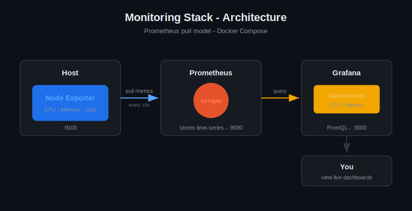

# Prometheus + Grafana Monitoring Stack

A production-pattern observability stack that collects live host metrics and visualizes them on real-time dashboards. Built with Prometheus, Grafana, and Node Exporter, running on Docker Compose.

**Live metrics:** CPU usage and memory usage, scraped every 15 seconds and displayed on a Grafana dashboard.

---

## Why I built this

I operated a cloud-native 5G core at Nokia, on-call for production infrastructure at a 99.9% SLA serving 100,000+ subscribers per deployment. You cannot hold an SLA you cannot see - monitoring is what makes an SLA measurable, and it is what wakes you up before a customer notices something is wrong.

I built this stack to demonstrate that observability discipline hands-on: collecting metrics, visualizing them, and understanding the difference between a useful signal and noise.

---

## Architecture

The flow is a pull model:

1. **Node Exporter** runs on the host and exposes its vitals (CPU, memory, disk) on port 9100.
2. **Prometheus** scrapes those metrics every 15 seconds and stores them as time-series data.
3. **Grafana** queries Prometheus using PromQL and renders live dashboards.

A key design point: the monitoring stack is deliberately separate from what it monitors. The watcher has to survive what it watches - if monitoring lived on the same machine that failed, the alert would die with it.

---

## Components

| Component | Role | Port |
|-----------|------|------|
| Prometheus | Collects and stores metrics (pull model) | 9090 |
| Node Exporter | Exposes host CPU / memory / disk metrics | 9100 |
| Grafana | Dashboards and visualization | 3000 |

---

## The queries

**Memory usage %** - Prometheus has no direct "memory used" metric, so it is derived from available vs total:

\`\`\`promql
100 * (1 - node_memory_MemAvailable_bytes / node_memory_MemTotal_bytes)
\`\`\`

**CPU usage %** - there is also no direct "CPU busy" metric. The trick is to measure how much the CPU is idle and subtract from 100:

\`\`\`promql
100 - (avg(rate(node_cpu_seconds_total{mode="idle"}[5m])) * 100)
\`\`\`

Measuring the opposite (idle) and inverting it is a standard Prometheus pattern - the CPU only tracks time spent per mode, so "busy" is inferred from "not idle."

---

## Running it

\`\`\`bash
docker compose up -d
\`\`\`

Then open:

- Prometheus: http://localhost:9090
- Grafana: http://localhost:3000  (default login: admin / admin)
- Node Exporter metrics: http://localhost:9100/metrics

To stop and remove the containers:

\`\`\`bash
docker compose down
\`\`\`

Everything runs locally on Docker Compose - no cloud resources, no cost.

---

## Design notes

- **Scrape interval is 15s** - frequent enough to catch real problems, not so frequent it wastes storage.
- **Alerting philosophy (next iteration):** alerts should fire on sustained conditions, not momentary blips. A CPU spike for 10 seconds is noise; 90% memory sustained for 5+ minutes is a real incident. Alerting on blips trains people to ignore alerts - that is alert fatigue, and it is how real outages get missed.

---

## Roadmap

- [ ] Alertmanager with a sustained-threshold alert rule (e.g. memory > 90% for 5m)
- [ ] Blackbox Exporter to monitor an application endpoint's up/down status
- [ ] Alert routing to email/Slack

---

## Stack

Prometheus | Grafana | Node Exporter | Docker Compose | PromQL
